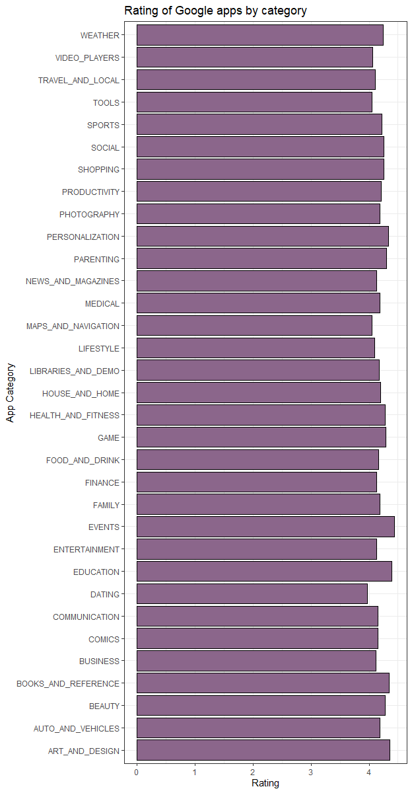
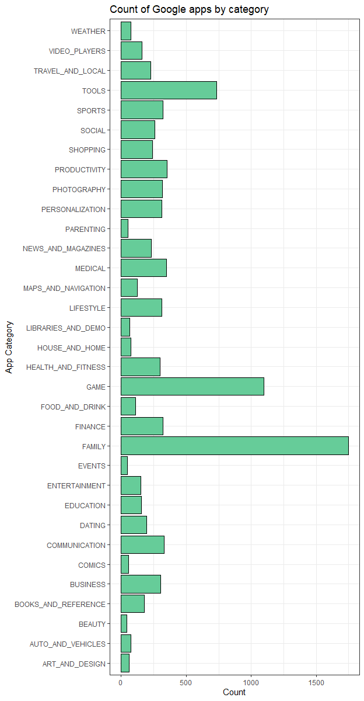
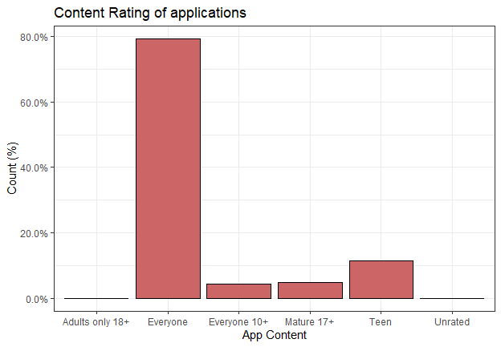

Індивідульна робота. Аналіз показників застосунків у Google Play Store
================

Вибір набору даних
------------------

Дя подальшого аналізу було взято набір даних, що містить список застосунків та їх характеристик, взятих з Google Play Store (<https://www.kaggle.com/lava18/google-play-store-apps#googleplaystore.csv>).

Дані програми Play Store мають величезний потенціал для досягнення успіху в бізнесі по додатках. Розробники можуть отримати корисну інформацію для роботи на ринку Android, можна визначити як формується рейтинг та які застосунки є найпопкулярнішими.


Підготовка вхідних даних
------------------------

Використовуємо бібліотеку tidyverse та scales, що містить корисні функції для аналізу даних та побудови графіків

``` r
library(tidyverse)
library(scales)
```

Зчитуємо файл формату csv. Отримаємо кількість записів, що містять дані.

``` r
all_apps <- read.csv('D:\\1\\googleplaystore.csv')

nrow(all_apps)
```

    ## [1] 10841

Викличемо функцію summary(), яка дає змогу подивитися на підсумкові результати різних властивостей даних.

``` r
summary(all_apps)
```
```R
                                                   App                Category   
 ROBLOX                                           :    9   FAMILY      :1972  
 CBS Sports App - Scores, News, Stats & Watch Live:    8   GAME        :1144  
 8 Ball Pool                                      :    7   TOOLS       : 843  
 Candy Crush Saga                                 :    7   MEDICAL     : 463  
 Duolingo: Learn Languages Free                   :    7   BUSINESS    : 460  
 ESPN                                             :    7   PRODUCTIVITY: 424  
 (Other)                                          :10796   (Other)     :5535  
     Rating          Reviews                     Size             Installs   
 Min.   : 1.000   0      : 596   Varies with device:1695   1,000,000+ :1579  
 1st Qu.: 4.000   1      : 272   11M               : 198   10,000,000+:1252  
 Median : 4.300   2      : 214   12M               : 196   100,000+   :1169  
 Mean   : 4.193   3      : 175   14M               : 194   10,000+    :1054  
 3rd Qu.: 4.500   4      : 137   13M               : 191   1,000+     : 907  
 Max.   :19.000   5      : 108   15M               : 184   5,000,000+ : 752  
 NA's   :1474     (Other):9339   (Other)           :8183   (Other)    :4128  
   Type           Price               Content.Rating           Genres    
 0   :    1   0      :10040                  :   1   Tools        : 842  
 Free:10039   $0.99  :  148   Adults only 18+:   3   Entertainment: 623  
 NaN :    1   $2.99  :  129   Everyone       :8714   Education    : 549  
 Paid:  800   $1.99  :   73   Everyone 10+   : 414   Medical      : 463  
              $4.99  :   72   Mature 17+     : 499   Business     : 460  
              $3.99  :   63   Teen           :1208   Productivity : 424  
              (Other):  316   Unrated        :   2   (Other)      :7480  
         Last.Updated              Current.Ver               Android.Ver  
 August 3, 2018: 326   Varies with device:1459   4.1 and up        :2451  
 August 2, 2018: 304   1.0               : 809   4.0.3 and up      :1501  
 July 31, 2018 : 294   1.1               : 264   4.0 and up        :1375  
 August 1, 2018: 285   1.2               : 178   Varies with device:1362  
 July 30, 2018 : 211   2.0               : 151   4.4 and up        : 980  
 July 25, 2018 : 164   1.3               : 145   2.3 and up        : 652  
 (Other)       :9257   (Other)           :7835   (Other)           :2520  
 ```
 
З цих даних видно, що показник Rating - 5-зірковий рейтинг, що використовується користувачами для оцінки застосунку, має багато значень NA. Ці дані є основним критерієм оцінки застосунку кориситувачами, тому рядки з порожніми значеннями ми можемо видалити. Подивимось, записів залишилось.

``` r
all_apps <- all_apps[!is.na(all_apps$Rating),]

nrow(all_apps)
```

    ## [1] 9367

Для ілюстрації змісту датасету, викличемо функції head() і tail(), щоб подивитися на перші та останні рядки даних відповідно.

``` r
head(all_apps, 10)

```
```R
                                                    App       Category Rating
1        Photo Editor & Candy Camera & Grid & ScrapBook ART_AND_DESIGN    4.1
2                                   Coloring book moana ART_AND_DESIGN    3.9
3  U Launcher Lite – FREE Live Cool Themes, Hide Apps ART_AND_DESIGN    4.7
4                                 Sketch - Draw & Paint ART_AND_DESIGN    4.5
5                 Pixel Draw - Number Art Coloring Book ART_AND_DESIGN    4.3
6                            Paper flowers instructions ART_AND_DESIGN    4.4
7               Smoke Effect Photo Maker - Smoke Editor ART_AND_DESIGN    3.8
8                                      Infinite Painter ART_AND_DESIGN    4.1
9                                  Garden Coloring Book ART_AND_DESIGN    4.4
10                        Kids Paint Free - Drawing Fun ART_AND_DESIGN    4.7
   Reviews Size    Installs Type Price Content.Rating                    Genres
1      159  19M     10,000+ Free     0       Everyone              Art & Design
2      967  14M    500,000+ Free     0       Everyone Art & Design;Pretend Play
3    87510 8.7M  5,000,000+ Free     0       Everyone              Art & Design
4   215644  25M 50,000,000+ Free     0           Teen              Art & Design
5      967 2.8M    100,000+ Free     0       Everyone   Art & Design;Creativity
6      167 5.6M     50,000+ Free     0       Everyone              Art & Design
7      178  19M     50,000+ Free     0       Everyone              Art & Design
8    36815  29M  1,000,000+ Free     0       Everyone              Art & Design
9    13791  33M  1,000,000+ Free     0       Everyone              Art & Design
10     121 3.1M     10,000+ Free     0       Everyone   Art & Design;Creativity
         Last.Updated        Current.Ver  Android.Ver
1     January 7, 2018              1.0.0 4.0.3 and up
2    January 15, 2018              2.0.0 4.0.3 and up
3      August 1, 2018              1.2.4 4.0.3 and up
4        June 8, 2018 Varies with device   4.2 and up
5       June 20, 2018                1.1   4.4 and up
6      March 26, 2017                1.0   2.3 and up
7      April 26, 2018                1.1 4.0.3 and up
8       June 14, 2018           6.1.61.1   4.2 and up
9  September 20, 2017              2.9.2   3.0 and up
10       July 3, 2018                2.8 4.0.3 and up
```

``` r
tail(all_apps, 10)
```

```R
                                                App            Category Rating
10829                       Manga-FR - Anime Vostfr              COMICS    3.4
10830                Bulgarian French Dictionary Fr BOOKS_AND_REFERENCE    4.6
10831                             News Minecraft.fr  NEWS_AND_MAGAZINES    3.8
10833                                      FR Tides             WEATHER    3.8
10834                                   Chemin (fr) BOOKS_AND_REFERENCE    4.8
10835                                 FR Calculator              FAMILY    4.0
10837                              Sya9a Maroc - FR              FAMILY    4.5
10838              Fr. Mike Schmitz Audio Teachings              FAMILY    5.0
10840                 The SCP Foundation DB fr nn5n BOOKS_AND_REFERENCE    4.5
10841 iHoroscope - 2018 Daily Horoscope & Astrology           LIFESTYLE    4.5
      Reviews               Size    Installs Type Price Content.Rating
10829     291                13M     10,000+ Free     0       Everyone
10830     603               7.4M     10,000+ Free     0       Everyone
10831     881               2.3M    100,000+ Free     0       Everyone
10833    1195               582k    100,000+ Free     0       Everyone
10834      44               619k      1,000+ Free     0       Everyone
10835       7               2.6M        500+ Free     0       Everyone
10837      38                53M      5,000+ Free     0       Everyone
10838       4               3.6M        100+ Free     0       Everyone
10840     114 Varies with device      1,000+ Free     0     Mature 17+
10841  398307                19M 10,000,000+ Free     0       Everyone
                 Genres      Last.Updated        Current.Ver        Android.Ver
10829            Comics      May 15, 2017              2.0.1         4.0 and up
10830 Books & Reference     June 19, 2016               2.96         4.1 and up
10831  News & Magazines  January 20, 2014                1.5         1.6 and up
10833           Weather February 16, 2014                6.0         2.1 and up
10834 Books & Reference    March 23, 2014                0.8         2.2 and up
10835         Education     June 18, 2017              1.0.0         4.1 and up
10837         Education     July 25, 2017               1.48         4.1 and up
10838         Education      July 6, 2018                1.0         4.1 and up
10840 Books & Reference  January 19, 2015 Varies with device Varies with device
10841         Lifestyle     July 25, 2018 Varies with device Varies with device
```

Аналіз характеристик застосунків
--------------------------------

Всі застосунки у датасеті належать до певної категорії (Category). Всього їх 34.
Проаналізуємо як застосунки разподілені між категоріями і як від цього залежить рейтинг.

``` r
grouped_by_category <- group_by(all_apps, Category)

app_categories <- summarize(grouped_by_category, 
              count = n(), 
              ratings = mean(Rating, na.rm=T))

app_categories
```

```R
# A tibble: 34 x 3
   Category            count ratings
   <fct>               <int>   <dbl>
 1 1.9                     1   19   
 2 ART_AND_DESIGN         62    4.36
 3 AUTO_AND_VEHICLES      73    4.19
 4 BEAUTY                 42    4.28
 5 BOOKS_AND_REFERENCE   178    4.35
 6 BUSINESS              303    4.12
 7 COMICS                 58    4.16
 8 COMMUNICATION         328    4.16
 9 DATING                195    3.97
10 EDUCATION             155    4.39
# ... with 24 more rows
```

``` r
ggplot(data = app_categories[2:34,]) +
geom_col(aes(x = Category,
             y = ratings), fill = 'plum4', color = 'black') +
labs(title = 'Rating of Google apps by category',
     x = 'App Category',
     y = 'Rating') +
theme_bw() +
  coord_flip()
```



З діаграми ми можемо побачити, що в середньому по категоріям застосунки маюсть приблизно однаковий рейтинг. Отже, рейтинг застосунку не сильно залежить від його категорії. Також можна побачити, що всі категорій застосунків мають рейтинг більше 4, що каже про те, що більшість застосунків цих категорій мають високий рейтинг, а користувачі схильні ставити високі оцінки легше, ніж погані.

Подивимось як розподілена кількість застосунків між категоріями:
 
``` r
ggplot(data = app_categories[2:34,]) +
geom_col(aes(x = Category,
             y = (count)), fill = '#66CC99', color = 'black') + 
            
    scale_y_continuous(labels = percent) + 
labs(title = 'Count of Google apps by category',
     x = 'App Category',
     y = 'Count') +
theme_bw() +
  coord_flip()
```


Найпоширенішою категорією серед застосунків є "Сімейна". На другому місці йдуть "Ігри", а на третьому "Інструменти". З цього можна сказати, що розважальний контент користується значно більшою популярністю у застосунках.


Застосунки мають таку характеристику як "Content Rating". Вона визначає до якої віковою категорії належить контент застосунку. Подивимось як розподілені категорї контенту застосунків.

``` r

grouped_by_content <- group_by(all_apps, Content.Rating)

content_ratings <- summarize(grouped_by_content, 
              count = n())

ggplot(data = content_ratings[2:7,]) +
geom_col(aes(x = Content.Rating,
             y = (count/sum(count))), fill = '#CC6666', color = 'black') + 
            
    scale_y_continuous(labels = percent) + 
labs(title = 'Content Rating of applications',
     x = 'App Content',
     y = 'Count (%)') +
theme_bw() 

```



Переважна більшість застосунків призначені для будь-якого віку. І лише 3 з майжу 10 000 застосунків належать до віковою категорії 18+. Таким чином, розробники віддають перевагу більш широкому колу користувачів. що є правильним з точки зору охоплення більшої цільової аудиторії.

Актуальні застосунки мають постійно оновлюватися та підтримуватися розробниками. Для того, щоб дізнатися які застосунки є наразі актуальними, отримаємо колонку "Рік" з колонки дати останнього оновлення застосунку, щоб подивитися, якого року було останнє оновлення.

``` r
only_year <- separate(all_apps, Last.Updated, c(NA,'year'), sep = ',', remove = F, extra = 'drop') 
all_apps <- mutate(only_year, year = str_trim(year, 'both'))

unique(all_apps$year)
```

    ##  [1] "2018" "2017" "2014" "2016" "2015" "2013" "2012" "2011" "2010"

Перевіримо, як розподіденні застосунки за роком останнього оновлення.

``` r
grouped_by_year <- group_by(all_apps, year)
year_data = arrange(summarise(grouped_by_year, count=n()), desc(count))

year_data <- filter(year_data)

year_data
```

      year  count
     <chr> <int>
    1 2018   6508
    2 2017   1498
    3 2016    651
    4 2015    388
    5 2014    190
    6 2013     94
    7 2012     21
    8 2011     15
    9 2010      2

Отже, переважна більшість застосунків оновлювались у останні два роки, а отже є актуальними.


Висновки
--------

-   Рейтинги застосунків мало залежать від їх категорії
-   Більшість застосунків належить категорії "Сімейна", далі - "Ігри", потім - "Інструменти". Розважальний контент користується значно більшою популярністю у застосунках.
-   За віковою категорією переважають застосунки, доступні будь-якому віку
-   переважна більшість застосунків оновлювались у останні два роки, а отже є актуальними

Ця інформація може стати у пригоді як проектному менеджеру, так і розробникам у аналізі ринку застосунків та вибору концепції та шляху подальшого розвитку для свого застосунку. В перспективі можна проаналізувати такі показники як кількість завантажень та вагу застосунка, що є також важливими при  виборі користувача.
