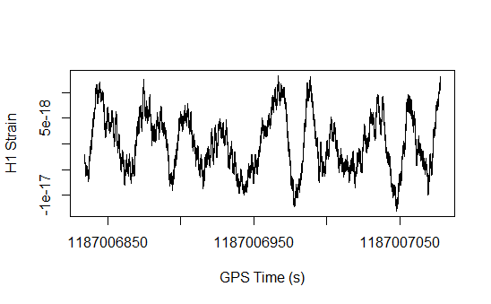

Лабораторна робота № 2. Формат HDF5
================

Завдання 1
----------

Завантажте файл з даними за посиланням <https://dcc.ligo.org/public/0146/P1700337/001/H-H1_LOSC_C00_4_V1-1187006834-4096.hdf5>

``` r
download.file(url="https://dcc.ligo.org/public/0146/P1700337/001/H-H1_LOSC_C00_4_V1-1187006834-4096.hdf5", destfile = "lab2.hdf5", mode="wb")
```

Завдання 2
----------

Встановить в R пакет для роботи з HDF5 файлами.

``` r
install.packages('BiocManager')
BiocManager::install('rhdf5')
library(rhdf5)
```

Завдання 3
----------

Виведіть зміст файлу командою h5ls().

``` r
library("rhdf5")
h5ls("lab2.hdf5")
```

    ##                  group            name       otype  dclass      dim
    ## 0                    /            meta   H5I_GROUP                 
    ## 1                /meta     Description H5I_DATASET  STRING    ( 0 )
    ## 2                /meta  DescriptionURL H5I_DATASET  STRING    ( 0 )
    ## 3                /meta        Detector H5I_DATASET  STRING    ( 0 )
    ## 4                /meta        Duration H5I_DATASET INTEGER    ( 0 )
    ## 5                /meta        GPSstart H5I_DATASET INTEGER    ( 0 )
    ## 6                /meta     Observatory H5I_DATASET  STRING    ( 0 )
    ## 7                /meta            Type H5I_DATASET  STRING    ( 0 )
    ## 8                /meta        UTCstart H5I_DATASET  STRING    ( 0 )
    ## 9                    /         quality   H5I_GROUP                 
    ## 10            /quality          detail   H5I_GROUP                 
    ## 11            /quality      injections   H5I_GROUP                 
    ## 12 /quality/injections InjDescriptions H5I_DATASET  STRING        5
    ## 13 /quality/injections   InjShortnames H5I_DATASET  STRING        5
    ## 14 /quality/injections         Injmask H5I_DATASET INTEGER     4096
    ## 15            /quality          simple   H5I_GROUP                 
    ## 16     /quality/simple  DQDescriptions H5I_DATASET  STRING        7
    ## 17     /quality/simple    DQShortnames H5I_DATASET  STRING        7
    ## 18     /quality/simple          DQmask H5I_DATASET INTEGER     4096
    ## 19                   /          strain   H5I_GROUP                 
    ## 20             /strain          Strain H5I_DATASET   FLOAT 16777216

Завдання 4
----------

Зчитайте результати вимірів. Для цього зчитайте name Strain з групи strain в змінну strain. Після зчитування не забувайте закривати файл командою H5Close().

``` r
strain <- h5read('lab2.hdf5', 'strain/Strain')
H5close()
```

Завдання 5
----------

Також з «strain/Strain» зчитайте атрибут (функція h5readAttributes) Xspacing в змінну st та виведіть її. Це інтервал часу між вимірами.

``` r
st <- h5readAttributes('lab2.hdf5', '/strain/Strain')$Xspacing
st
```
    ## [1] 0.0002441406

Завдання 6
----------

Знайдіть час початку події та її тривалість. Для цього з групи meta зчитайте в змінну gpsStart name GPSstart та в змінну duration name Duration.

``` r
gpsStart <- h5read('lab2.hdf5', 'meta/GPSstart')
gpsStart
```

    ## [1] 1187006834

``` r
duration <- h5read('lab2.hdf5', 'meta/Duration')
duration
```

    ## [1] 4096

Завдання 7
----------

Знайдіть час закінчення події та збережіть його в змінну gpsEnd.

``` r
gpsEnd <- gpsStart + duration
gpsEnd
```

    ## [1] 1187010930

Завдання 8
----------

Створіть вектор з часу вимірів і збережіть у змінну myTime. Початок послідовності – gpsStart, кінець – gpsEnd, крок – st.

``` r
myTime <- seq(gpsStart, gpsEnd, st)
```

Завдання 9
----------

Побудуємо графік тільки для першого мільйону вимірів. Для цього створіть змінну numSamples, яка дорівнює 1000000.

``` r
numSamples <- 1000000
```

Завдання 10
-----------

Побудуйте графік за допомогою функції plot(myTime\[0:numSamples\], strain\[0:numSamples\], type = "l", xlab = "GPS Time (s)", ylab = "H1 Strain")

``` r
plot(myTime[0:numSamples], strain[0:numSamples], type = "l", xlab = "GPS Time (s)", ylab = "H1 Strain")
```


